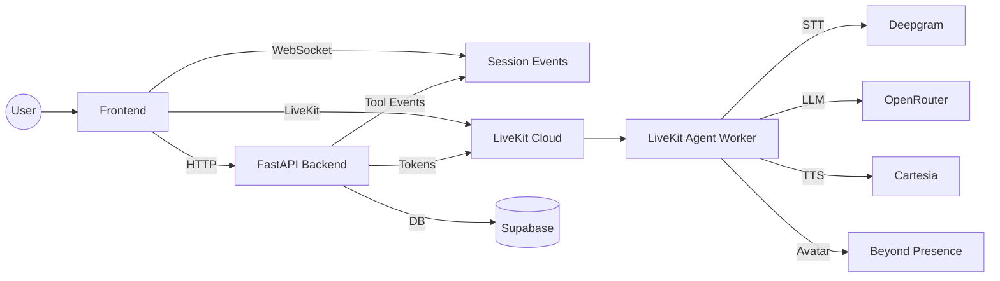

# Voice Agent Backend

Backend services for the AI voice scheduling assistant. This repo hosts:
- FastAPI backend (sessions, tool calls, summaries, Supabase persistence)
- LiveKit Agent worker (STT, LLM, TTS, avatar)

**Architecture**


**Core Flow**
1. Frontend starts a session (`/session/start`)
2. Backend issues LiveKit token (`/livekit/token`)
3. Agent joins LiveKit room and handles voice
4. Agent calls backend tools (book/retrieve/cancel/modify)
5. Backend stores data in Supabase and streams tool events
6. Summary is generated on end and sent to frontend

**Tech Stack**
- FastAPI
- LiveKit Agents (Python)
- Supabase (Postgres)
- Deepgram (STT)
- OpenRouter (LLM)
- Cartesia (TTS)
- Beyond Presence (Avatar)

**Prerequisites**
- Python 3.10+
- Supabase project
- LiveKit Cloud project
- API keys for STT/LLM/TTS/Avatar

**Setup**
```bash
python -m venv .venv
source .venv/bin/activate
pip install -r requirements.txt
cp .env.example .env
```

**Environment Variables**
- `LIVEKIT_URL`
- `LIVEKIT_API_KEY`
- `LIVEKIT_API_SECRET`
- `LIVEKIT_AGENT_NAME`
- `SUPABASE_URL`
- `SUPABASE_KEY`
- `OPENROUTER_API_KEY`
- `OPENROUTER_MODEL`
- `OPENAI_API_BASE`
- `OPENAI_API_KEY`
- `DEEPGRAM_API_KEY`
- `CARTESIA_API_KEY`
- `CARTESIA_VOICE_ID`
- `BEY_API_KEY`
- `BEY_AVATAR_ID`
- `BEY_ENABLED`
- `AGENT_GREETING`
- `HTTP_BASE_URL`
- `WS_BASE_URL`
- `BACKEND_BASE_URL`

**Run API**
```bash
uvicorn app.main:app --host 0.0.0.0 --port 8000
```

**Run Agent Worker**
```bash
python agent.py start
```

**Database**
Run the schema in `supabase_schema.sql` to create tables.

**Tooling**
- `identify_user`: ask for phone number to identify user
- `fetch_slots`: return suggested available slots (suggestions only)
- `book_appointment`: create and store an appointment (prevents double booking)
- `retrieve_appointments`: list a user’s appointments
- `cancel_appointment`: cancel an appointment
- `modify_appointment`: reschedule an appointment
- `end_conversation`: close the session and generate a summary
